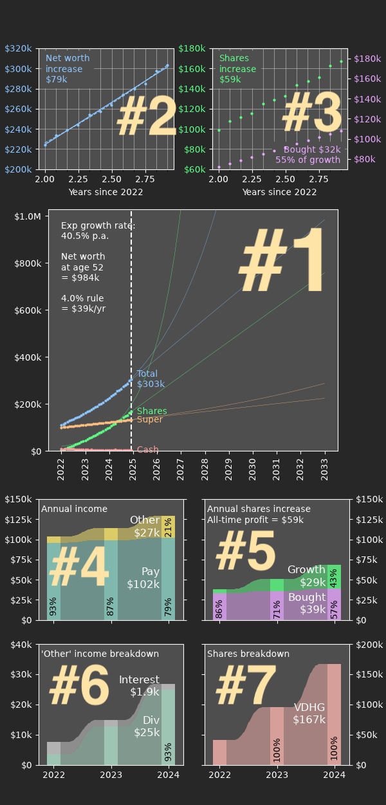

# Net worth dashboard — visualisation

## Introduction

At time of writing the dashboard is hard-coded to the following 7 panel view.

This dashboard is intended to be viewed on a phone screen. The aspect ratio and overall sizing can be adjusted to suit your device using the parameters `figw` and `figh` (in centimeters).

## 7 panel dashboard

### #1 — main panel

The main panel shows the evolution of net worth over time and projects it into the future. (An interface is planned to turn the projections off and on.)

A linear projection is considered “worse case scenario” but is likely to be reasonably accurate over short time periods. The exponential projection is theoretically more accurate (as larger investments will accumulate more quickly) but can also be wildly optimistic except for perfect datasets.

The timeframe for this plot is from the beginning of the entries in the CSV file (customisable with `since_yr`) until the sooner of: 10 years into the future, or your intended retirement year.

Some additional information about the net worth projection is displayed textually. With a timeframe limited by the plot axis, the linear extrapolation of net worth is shown, alongside the 4% value of drawing down your portfolio in retirement. The drawdown percentage can be customised with the parameter `retire_ratio`.

Finally, a series of linear extrapolations are added to the plot. These track the expected time to reach certain net worth milestones within the time window shown, and are set up automatically to track roughly exponential targets. The targets can be customised with `linear_targets`.

### #2 — total worth trendlines

From the zoomed out perspective of the main panel, it can be difficult to see individual entries and get a feel for how well the trendlines match the data.

Panel 2 shows the window of data used to calculate the linear trendline, by default 1.0 years (customise with `linear_window`). This panel is useful for tracking short term variations and see changes in net worth rate as they happen.

### #3 — shares investments

Panel 3 shows the same window of data, comparing the growth in share value over the recent period vs the amount of shares bought. Hopefully for the most part the growth of value will outpace the expenditure!

This graph uses separate axes in case the two values diverge significantly. Care is taken to ensure the same y-axis range is used in both axes to allow for visual comparisons of difference and slope.

Over the period, the total delta in shares worth is compared against the total value of shares purchased. This comparison is repeated later in panel 5; note the colours are consistent. The interpretation of this comparison is essentially to highlight that as your wealth grows, the yearly increases should become a smaller component of the growth. If growth is roughly equal to expenditure then the investments have been stagnant over the period.

### #4 — annual income

Panels 4–7 are Sankey plots which summarise yearly measures.

Panel 4 highlights the relative breakdown of income from year to year. Incremental growth in pay scale should hopefully be visible, augmented with an increasing contribution from passive investments such as interest and share dividends.

For most people, their employment pay will likely be a large majority of their income. Income less than 20% of the aggregated total is combined into a single "Other" category and compared in more detail in Panel 6. This 20% threshold can be adjusted with the parameter `income_thresh`.

### #5 — share value difference

Panel 5 shows the *difference* in shares worth from year to year. This is divided into two components: the amount of shares purchased, and the amount they increased in value in the market. (Note the similarity with Panel 3.)

This visualisation breaks down a little when there is negative share growth, or the selling of shares is greater than the growth.

The y-axis of panels 4 and 5 are forced equal to allow visual comparison between your annual income and your annual increase in shares. As the power of compound interest takes over you should find that your share portfolio might start to increase in value at a rate that exceeds your income.

### #6 — other income

This panel is purely designed to dive into the detail of your "Other" income streams. Since for many people the majority of this income will come from shares dividends, the placement of this panel alongside panel 7 allows visual comparison of your increase in dividends as your share portfolio increases.

### #7 — share portfolio breakdown

If you an investor in a single all-market ETF like VDHG this panel will not have much information beyond an alternate view of your shares worth. For people with an investment portfolio which needs rebalancing, this panel is more useful as the relative percentage of each share in your portfolio is displayed directly.